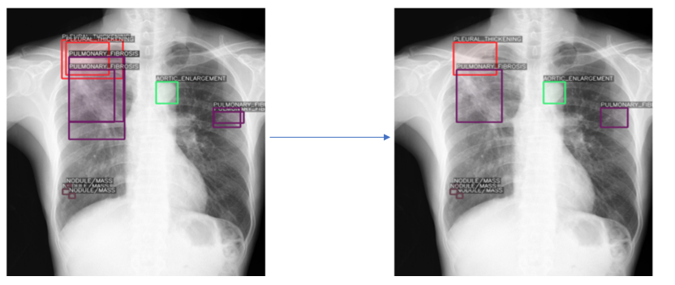

# Chest_Xray_Detection
This project used pretrained model RetinaNet of fizyr for thoracic lung diseases detection
- Link dataset: https://www.kaggle.com/c/vinbigdata-chest-xray-abnormalities-detection
- Link: https://github.com/fizyr/keras-retinanet

- This project is described is more detail in project_analysis folder
### 1. Non Maximum Suppression (NMS), Soft Non Maximum Suppression (Soft - NMS) and Weighted Boxes fusion (WBF)
||      Number of Boxes      | 
|----------|:-------------:|
| Original Boxes | 36,096|
| NMS| 23,940|
| Soft - NMS | 32,273 |
|WBF | 23,955|

> Base on the result and algorithm of these techniques. I selected WBF > 

**Before and after apply WBF**

### 2. RetinaNet model
- RetinaNet Architecture

- Backbone
|  Backbone |  mAP |  Computational Cost|Size of mode |
|---|---|---|---|---|
| RestNet 50  | 0.0415   | 40 mins   | 246 MB    | 
|  RestNet 101 |   0.10866  |  53 mins   |  321 MB    |   
| RestNet 152|0.0131         | 63 mins        | 383 MB       |
|MobileNet 160| 0.00053      | 28 mins        | 134 MB       |
|MobileNet 128|0.00062       | 25 mins        | 120 MB       | 

|Backbone|      mAP    | Computational Cost| Size of model| 
|------------|-------------| -------------|-------------|
| RestNet 50 | 0.0415        | 40 mins        | 246 MB       | 
| RestNet 101| 0.10866       | 53 mins        | 321 MB       |
| RestNet 152|0.0131         | 63 mins        | 383 MB       |
|MobileNet 160| 0.00053      | 28 mins        | 134 MB       |
|MobileNet 128|0.00062       | 25 mins        | 120 MB       | 
